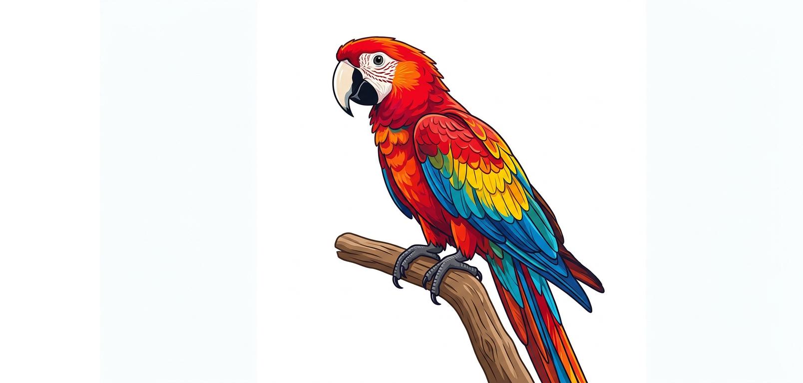
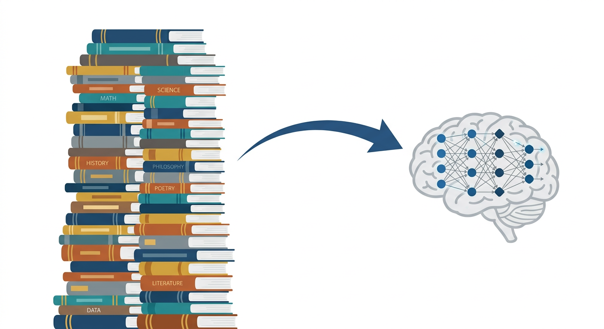
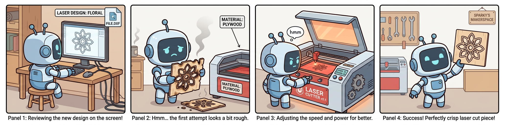
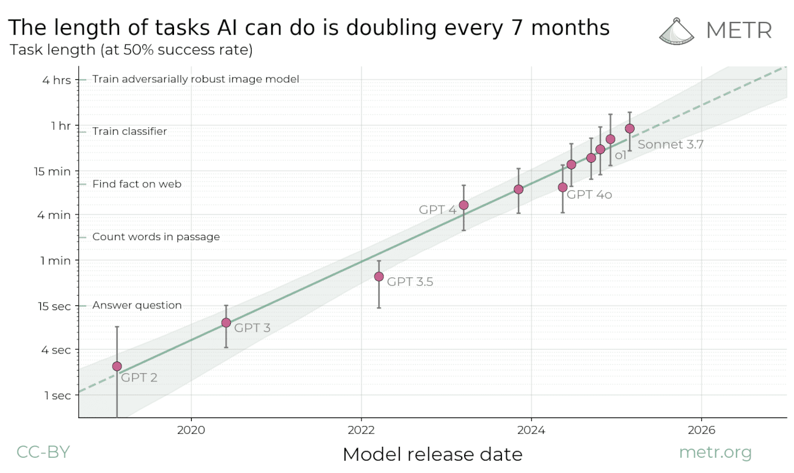

<!-- _class: lead -->

# Agentic AI with Claude Code and Open Claw

Cape Fear Makers Guild

---

# LLMs and the Pretraining Miracle

**"It's just a stochastic parrot"** — not quite.

- Predict the next token on **trillions** of words from the internet
- No labels needed — the text **is** the training signal
- No labeling bottleneck → scale to massive datasets cheaply

---

# Pretraining Input

> `The quick brown fox jumps over the lazy`

---

# Compression = Learning

A model with **N** parameters trained on **≫ N** tokens can't memorize — it **must** compress

- Forced to find patterns, structure, and abstractions
- Regularization through sheer data pressure
- This is why scaling works: more parameters + a lot more data → deeper understanding

> A stochastic parrot memorizes. A model that compresses **generalizes**.

---

# Compression = Learning

---

# The ChatGPT Moment

Pretrained models know a lot — but they're **unpredictable**

- Raw models ramble, contradict, hallucinate, and ignore instructions
- Brilliant but unruly — like a genius with no social skills

**RLHF** (Reinforcement Learning from Human Feedback) changed everything

- Humans rate outputs → model learns what "helpful" looks like
- Aligns the raw capability to **follow instructions** and **be useful**
- This is what turned a research artifact into a product billions use

---

# RLHF Input

> `[USER] What is the capital of France? [/USER] [ASSISTANT] The capital of France is Paris. [/ASSISTANT]`

---

# Thinking Models

The next breakthrough: **let the model reason before answering**

- Model gets a hidden scratchpad — a "thinking block"
- Reinforcement is based on the **final answer**, not the thinking
- The model discovers its own reasoning strategies

Why this matters:

- No one teaches it **how** to think — only **what's correct**
- It learns to plan, backtrack, and self-correct on its own
- Unlocks performance on math, code, and complex multi-step problems

---

# Thinking Input

> `[USER] What is 37×53? [/USER] [THINKING] Let me work this out... 37×50=1850, 37×3=111, so 1850+111=1961 [/THINKING] [ASSISTANT] 1961 [/ASSISTANT]`

---

# Tool Use

Models can't interact with the real world on their own — **tools fix that**

How it actually works (no magic):

1. Model outputs "I want to call `search('weather NYC')`"
2. We intercept that, run the tool, return the result
3. Model continues with the new information

- Try things, get feedback, adjust — just like humans
- Trained during thinking blocks so the model learns **when** and **how** to reach for tools
- Read files, run code, search the web, call APIs — anything you wire up

---

# Tool Use

---

# Tool Use Input

> `[USER] What's the weather in NYC? [/USER] [THINKING] I need the weather [TOOL_USE] search("weather NYC") [/TOOL_USE] [TOOL_RESULT] 72°F, sunny [/TOOL_RESULT] [/THINKING] [ASSISTANT] It's 72°F and sunny in NYC. [/ASSISTANT]`

---

# Persistence

Agents are **more persistent than humans** — they don't get bored or frustrated

The catch: they need to know when to **stop**

- The more explicit your exit criteria, the longer an agent can work effectively
- Vague goals → spinning wheels. Clear "done" → deep iteration.

**Context management** matters for long-running tasks

- Models have finite context windows — fill it up and quality degrades
- **Skills**: predefined prompts that inject focused instructions without bloating context
- **Subagents**: spin up a child agent for a subtask, get back a summary, keep the parent lean

---

# Task Length Is Growing

---

# Claude Code Demo

1. Install and sign in — [code.claude.com/docs/en/quickstart](https://code.claude.com/docs/en/quickstart)
2. Explore slash commands and skills
3. Create a pygame game from scratch
4. Watch it install dependencies automatically
5. Run the game, hit errors, watch it fix them
6. Iterate until it works

---

# If It's a CLI, It's a Tool

Agents already know how to use a terminal

- If your tool has a CLI, an agent can figure out how to use it
- `--help`, man pages, error messages — all feedback the agent can learn from
- No special integration needed — just give it shell access

**Classic**: `git`, `docker`, `ffmpeg`, `curl`, `python`, package managers

**Modern**: `gh`, `gcloud`, `discord`, `gws` — interact with the web without a browser

Agents *can* navigate browsers through image input, but CLIs are faster, more reliable, and token efficient

---

# Open Claw Demo

1. Install Open Claw — [docs.openclaw.ai/start/getting-started](https://docs.openclaw.ai/start/getting-started)
2. Set up with OpenRouter
3. Configure with the web UI

---

# CFMB — Our Home Grown Discord Bot

Claude Code and Open Claw are just wrappers around models — no reason you can't build your own

- Custom agent tailored to our community
- [github.com/rowland-208/cfmb](https://github.com/rowland-208/cfmb/tree/main/cfmb)

---

<!-- _class: lead -->

# Questions?

Cape Fear Makers Guild — April 7, 2026

capefearmakersguild.org
