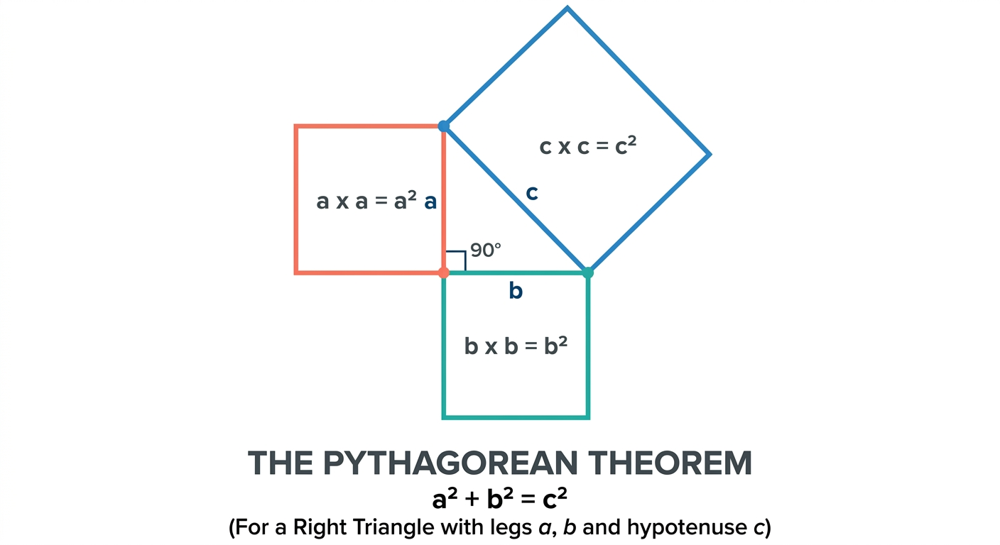

# The Pythagorean Theorem

### One of Mathematics' Most Famous Results

---

## What Is the Pythagorean Theorem?

For any **right triangle**, the relationship between the sides is:

$$a^2 + b^2 = c^2$$

- **a** and **b** are the two shorter sides (legs)
- **c** is the longest side (hypotenuse), opposite the right angle

Named after the Greek mathematician **Pythagoras** (~570-495 BC), though known to Babylonians over 1,000 years earlier.

---

## Visual Proof

The area of the square on the hypotenuse equals the sum of the areas of the squares on the other two sides.

$$3^2 + 4^2 = 5^2$$
$$9 + 16 = 25$$

---

## Real-World Applications

- **Construction** -- ensuring walls are square and foundations are level
- **Navigation** -- calculating straight-line distances between two points
- **Architecture** -- designing roof pitches and ramp angles
- **GPS** -- determining positions from satellite distances
- **Computer graphics** -- calculating distances between pixels

---

## Try It Yourself

**Problem:** A ladder leans against a wall. The base is **6 feet** from the wall, and the ladder is **10 feet** long. How high up the wall does it reach?

$$6^2 + h^2 = 10^2$$
$$36 + h^2 = 100$$
$$h^2 = 64$$
$$h = 8 \text{ feet}$$

The ladder reaches **8 feet** up the wall.
