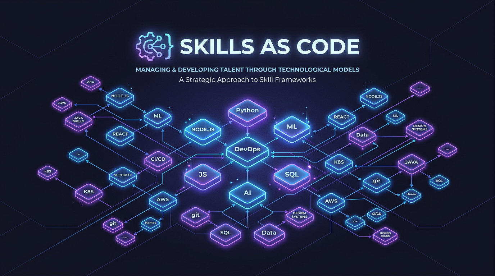
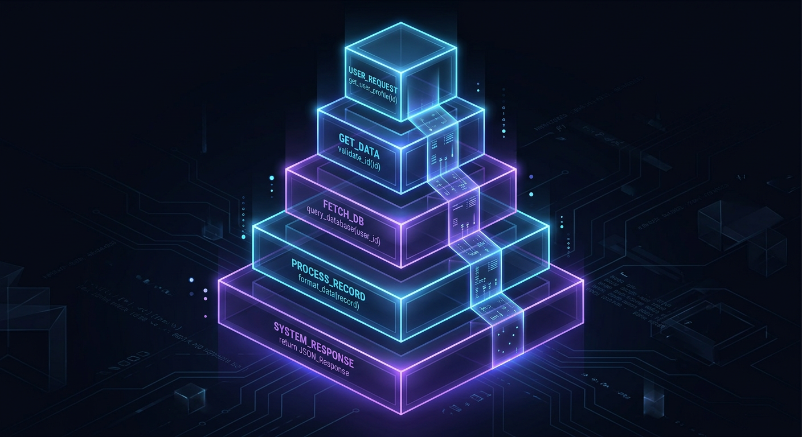
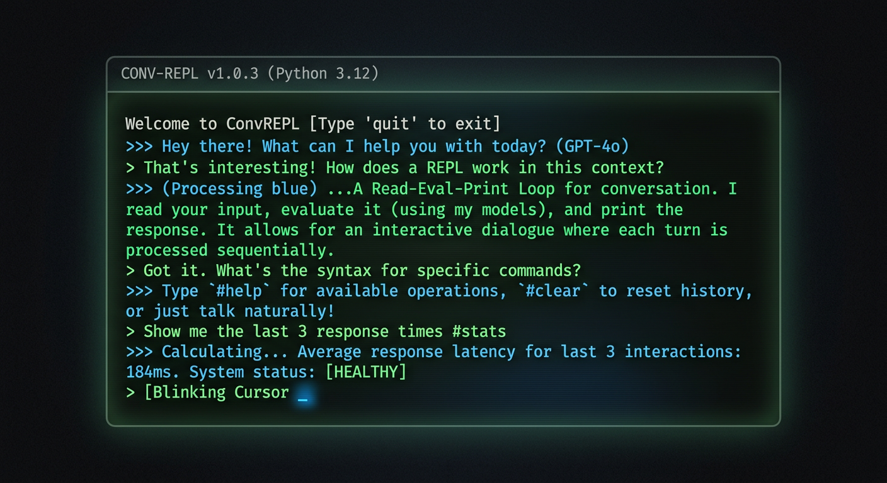

<!-- _class: title -->
<!-- _paginate: false -->
<!-- _backgroundColor: #121525 -->



# Skills as Code
### Claude Skills Are a New Kind of Programming

---

## What Is a Skill?

- A **reusable unit of functionality** — invoked by name, like calling a function
- Written in natural language, stored as markdown files
- Takes input, performs work, produces output
- Lives in `.claude/skills/` — version-controlled alongside your code

```
.claude/skills/
├── generate-deck/SKILL.md
├── verify/SKILL.md
├── publish/SKILL.md
└── generate-image/SKILL.md
```

---

## Skills Are Functions

| Programming Concept | Skill Equivalent |
|---|---|
| Function definition | `SKILL.md` file with instructions |
| Function call | `/skill-name` invocation |
| Parameters | Arguments passed in the user prompt |
| Return value | The artifact produced (file, commit, output) |
| Library / module | A directory of related skills |

The mental model maps directly — skills **are** functions for an AI runtime.

---

<!-- _backgroundColor: #080b1b -->

## Layered Abstractions



Skills can call other skills — just like functions calling functions.

```
/generate-deck
  ├── Creates draft slides
  ├── /verify         ← fact-checks all claims
  ├── /generate-image ← creates visuals
  └── /publish        ← exports, commits, pushes
```

- Each skill is **self-contained** but composable
- Higher-level skills orchestrate lower-level ones
- You build **complex workflows from simple primitives**

---

## CLAUDE.md Is Your Config File

- `CLAUDE.md` sets the **runtime environment** — conventions, paths, preferences
- Like `.bashrc`, `tsconfig.json`, or `pyproject.toml`
- Every conversation loads it automatically
- Global `~/.claude/CLAUDE.md` for user-wide defaults
- Project-level `CLAUDE.md` for repo-specific behavior

**The config shapes the runtime. The skills define the operations.**

---

<!-- _backgroundColor: #0e0f12 -->

## The Interactive REPL



Using Claude interactively is a **Read-Eval-Print Loop**:

1. **Read** — you type a prompt
2. **Eval** — Claude interprets and executes
3. **Print** — results appear (files, code, output)
4. **Loop** — you iterate based on what you see

- Immediate feedback, fast iteration
- Prototype a workflow, then **extract it into a skill**
- The REPL is where skills are born

---

<!-- _backgroundColor: #0d0d1b -->

## But the Language Is Fuzzy


`2 + 2` → always `4`
Same skill, same input → **different outputs each time**

- The runtime is **non-deterministic**
- This isn't a bug — it's a **fundamental property**
- You're programming a system that **interprets intent**

> "The skill says what to do. The model decides how."

---

## Testing Skills

If skills are code, they need **testing** — but testing looks different here.

- **Behavioral testing** — does the skill produce the right *kind* of output?
- **Boundary testing** — what happens with unusual inputs?
- **Regression testing** — does it still work after you change the prompt?
- **Composition testing** — do layered skills interact correctly?

You can't assert exact equality. You assert **properties and patterns**.
Like property-based testing, but for natural language.

---

## The Implications

- **Prompt engineering is programming** — just in a fuzzy, intent-based language
- **Skills are your codebase** — they grow, refactor, and need maintenance
- **CLAUDE.md is infrastructure** — it defines the platform your skills run on
- **Version control matters** — skills evolve, and you need to track changes
- **Composition is power** — small skills combine into sophisticated workflows

We're not replacing programming. We're **adding a new layer to it**.

---

<!-- _class: closing -->
<!-- _paginate: false -->

## The Best Programming Language Is the One That Understands You

### Skills turn conversation into automation.
