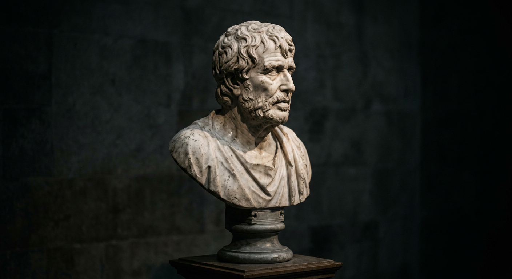
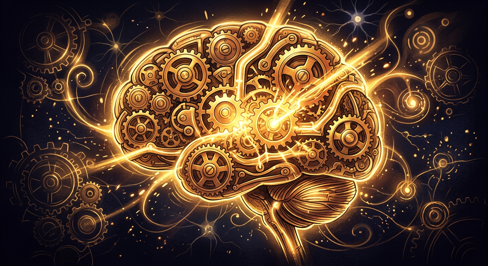

<!-- _class: title -->
<!-- _paginate: false -->
<!-- _backgroundColor: #020302 -->

# Stoicism
### Ancient Wisdom for the Modern Mind

---

## What Is Stoicism?

- A philosophy founded in **Athens around 300 BCE** by Zeno of Citium
- Core idea: we can't control events, but we can control our **responses**
- Not about suppressing emotions — about **understanding and reframing** them
- Key figures: **Marcus Aurelius**, **Seneca**, and **Epictetus**
- Now recognized as a forerunner of modern **cognitive psychology**

> "We suffer more often in imagination than in reality." — **Seneca**, *Letters to Lucilius* <!-- Source: Seneca, Epistulae Morales 13.4-5 -->

---

## The Dichotomy of Control

The most foundational Stoic idea — and the basis of modern cognitive reframing:

- **Up to us**: our opinions, intentions, desires, and aversions
- **Not up to us**: other people's behavior, outcomes, health, reputation

> "Make the best use of what is in your power, and take the rest as it happens."
> — **Epictetus**

This maps directly to the CBT concept of **distinguishing thoughts from situations**.

---

## Stoicism and Cognitive Behavioral Therapy

- **Aaron Beck** (founder of CBT) and **Albert Ellis** (founder of REBT) both cited Epictetus as a direct influence <!-- Source: https://thewalledgarden.com/albert-ellis-stoicism-as-the-root-of-cbt/ -->
- The CBT core model — *events → thoughts → emotions* — mirrors the Stoic discipline of **assent**
- Key shared techniques:

| Stoic Practice | CBT Equivalent |
|---|---|
| Examining impressions | Cognitive restructuring |
| Dichotomy of control | Identifying automatic thoughts |
| View from above | Perspective-taking / distancing |
| Negative visualization | Decatastrophizing |

---

<!-- _backgroundColor: #04040c -->

## Emotional Regulation Through Reframing

Stoics pioneered what psychologists now call **cognitive reappraisal**:

- An event is **neutral** — our judgment makes it good or bad
- **Labeling emotions** without acting on them (similar to mindfulness)
- Distinguishing between **first impressions** (involuntary reactions) and **assent** (chosen responses)
- Modern research shows cognitive reappraisal reduces amygdala activation and improves emotional resilience <!-- Source: https://pmc.ncbi.nlm.nih.gov/articles/PMC4193464/ -->

> "Men are disturbed not by things, but by the views which they take of them." — **Epictetus**, *Enchiridion* <!-- Source: Epictetus, Enchiridion Ch. 5 -->

---

<!-- _backgroundColor: #213134 -->

## Resilience and Post-Traumatic Growth

- Stoic philosophy has a long tradition in **military resilience culture**, influencing programs like the Army's Warrior Resilience and Thriving Program <!-- Source: https://www.army.mil/article/289608 -->
- Navy SEALs' "Big Four" mental toughness techniques — including **mental rehearsal** and visualization — draw on Stoic principles <!-- Source: https://sealfit.com/navy-seal-commanders-advice-developing-mental-toughness/ -->
- **Post-traumatic growth** research aligns with the Stoic idea that adversity builds character
- Viktor Frankl's **logotherapy** — finding meaning in suffering — echoes Stoic principles

> "The impediment to action advances action. What stands in the way becomes the way." — **Marcus Aurelius**, *Meditations* 5.20 <!-- Source: Marcus Aurelius, Meditations Book 5, Ch. 20 -->

---

## Mindfulness, Acceptance, and Stoicism

- **Acceptance and Commitment Therapy (ACT)** shares Stoic roots: accept what you can't change, commit to valued action
- Stoic **present-moment awareness** anticipates modern mindfulness practices
- **Negative visualization** (*premeditatio malorum*) is now studied as a gratitude and resilience intervention
- The Stoic concept of **amor fati** (love of fate) parallels radical acceptance in dialectical behavior therapy (DBT)

---

<!-- _backgroundColor: #341f12 -->

## Stoic Practices for Daily Life

- **Morning intention** — plan your day and anticipate obstacles ("premeditation of adversity")
- **Evening review** — reflect without self-judgment on what went well and what to improve
- **Cognitive distancing** — ask "Is this within my control?" before reacting
- **Voluntary discomfort** — cold exposure, fasting, or simplicity to build tolerance
- **Journaling** — Marcus Aurelius wrote *Meditations* as a private self-therapy journal

---

## The Science Behind Stoic Practices

- Studies show **expressive writing** (journaling) reduces stress and improves immune function <!-- Source: Pennebaker & Kiecolt-Glaser, https://journals.sagepub.com/doi/full/10.1177/1745691617707315 -->
- **Cognitive reappraisal** is one of the most well-supported emotion regulation strategies in psychology
- **Gratitude practices** (linked to negative visualization) improve well-being across dozens of studies
- The **Stoic Week 2013** experiment (Modern Stoicism / University of Exeter) found participants reported **14% increases in life satisfaction** after one week of Stoic exercises <!-- Source: https://modernstoicism.com/stoic-week/ -->

---

<!-- _class: closing -->
<!-- _paginate: false -->

## Thank You

### "The happiness of your life depends upon the quality of your thoughts."
— Marcus Aurelius
