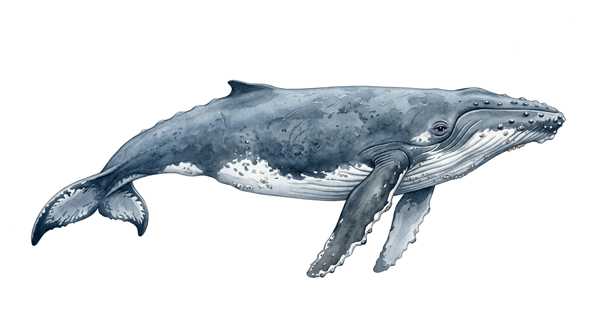
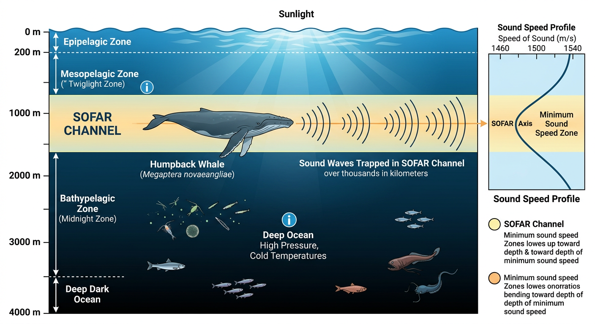
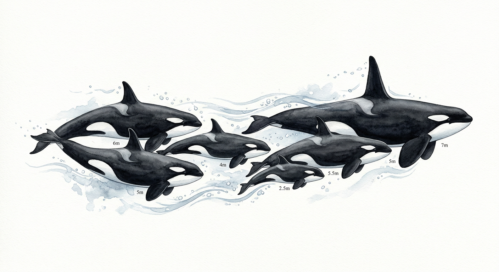
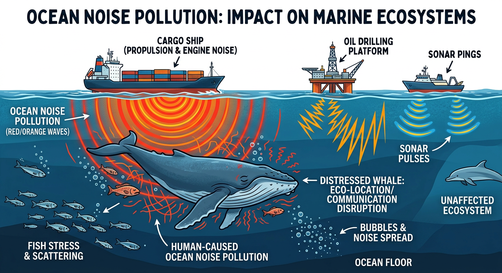

<!-- _class: title -->
<!-- _paginate: false -->

# Whale Communication
### Songs, Clicks, and Echoes Across the Ocean

---

## Why Do Whales Communicate?

- **Navigation** — coordinating movement across vast distances
- **Mating** — attracting partners with complex songs
- **Social bonding** — maintaining group cohesion
- **Feeding** — coordinating hunting strategies
- **Mother-calf contact** — staying connected in murky water

---

## Two Kinds of Whales, Two Kinds of Sound

| Baleen Whales | Toothed Whales |
|---|---|
| Humpbacks, blues, fins | Sperm whales, orcas, belugas |
| Low-frequency songs & calls | Clicks, whistles, and buzzes |
| No echolocation | Echolocation for hunting |
| Sound produced in larynx | Sound produced in nasal passages |

---

## Humpback Whale Songs

- Only **males** sing — songs last 10–20 minutes, repeated for hours
- All males in a population sing the **same song**
- The song **evolves** over the season — and changes spread across oceans
- Songs can travel **thousands of miles** through deep ocean channels
- Scientists still debate: is it for mating, territory, or something else?

---

<!-- _class: light -->
<!-- _backgroundColor: white -->

## The SOFAR Channel

- A layer of ocean (~1,000 m deep) where sound travels extraordinarily far
- Low-frequency whale calls can propagate **across entire ocean basins**
- Blue whale calls at 188 dB have been detected **thousands of kilometers** away
- Before industrial shipping noise, whales may have communicated across oceans

---

## Sperm Whale Clicks

- The **loudest animal sound** on Earth — up to 230 dB
- Used for **echolocation** to hunt squid in pitch-black depths
- Also produce patterned "codas" — rhythmic click sequences
- Different **clans** use different coda dialects
- Researchers believe codas encode **identity and social belonging**

---

<!-- _class: light -->
<!-- _backgroundColor: #f8f9f5 -->

## Orca Dialects

- Each orca pod has a **unique dialect** — a set of distinct calls
- Dialects are **learned**, passed from mother to calf
- Pods that share calls are grouped into **clans**
- Dialects help orcas identify family and avoid inbreeding
- Some researchers call this **culture**

---

## Beluga Whales: Canaries of the Sea

- Nicknamed for their **rich vocal repertoire**
- Produce clicks, whistles, chirps, and squeals
- Can **mimic human speech patterns** and other sounds
- Highly social — use sound to coordinate in Arctic ice
- One of the few whales with a **flexible neck** for directional sound

---

<!-- _class: light -->
<!-- _backgroundColor: #fefeff -->

## The Problem of Ocean Noise

- Shipping, sonar, and drilling create a **wall of noise**
- Whale communication range has **shrunk by 90%** since pre-industrial times
- Navy sonar linked to mass strandings of beaked whales
- Chronic noise causes **stress, behavioral changes**, and displacement
- Some whales are **shifting frequency** or calling louder to compensate

---

## What We're Still Learning

- Can whale songs carry **grammar or syntax**?
- Project CETI is using AI to **decode sperm whale codas**
- Are whale communication systems a form of **language**?
- How do whales adapt their calls to a **noisier ocean**?
- What can whale communication teach us about **the origins of language**?

---

<!-- _class: closing -->
<!-- _paginate: false -->

## Thank You

### The ocean is full of voices — we're just learning to listen.
